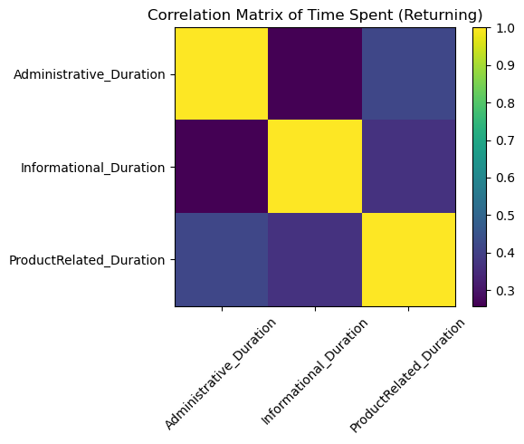
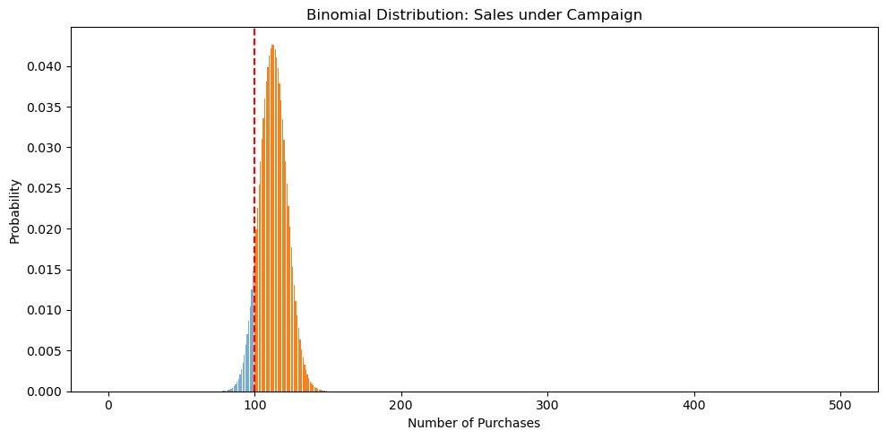

# Will This Customer Purchase Your Product? – Data Analysis and Predictive Model

## Overview & Project Objectives

In this project, I analyzed online shopping sessions during the busiest months (November and December) to understand customer behavior and test a predictive marketing scenario. My three main objectives were:

1. **Purchase Rates:** Calculate purchase (conversion) rates for _New_ vs _Returning_ customers in Nov–Dec.  
2. **Correlation Analysis:** Identify which page-time durations are most strongly correlated for returning customers.  
3. **Campaign Success Probability:** Estimate the probability of achieving at least 100 purchases out of 500 sessions if a campaign boosts returning-customer conversion by 15%.

---

## Dataset Description

I used a modified version of the UCI **Online Shoppers Purchasing Intention** dataset. Key changes:

- Renamed `VisitorType` → `CustomerType` (levels: `New_Customer`, `Returning_Customer`).  
- Renamed `Revenue` → `Purchase` (1 if purchase was made, else 0).  
- Excluded columns: `OperatingSystems`, `Region`, `Browser`, `TrafficType`.  
- Filtered for sessions in **November** and **December** only.  

After cleaning and filtering, the dataset contained **12,054 sessions** and 15 features. Major features:

| Feature                     | Description                                    |
|-----------------------------|------------------------------------------------|
| `Administrative_Duration`   | Time spent on administrative pages (sec)       |
| `Informational_Duration`    | Time spent on informational pages (sec)        |
| `ProductRelated_Duration`   | Time spent on product pages (sec)              |
| `BounceRates`               | Percentage of exits from the first page        |
| `ExitRates`                 | Percentage of exits from all pages             |
| `PageValues`                | Page value scores based on e-commerce metrics  |
| `Weekend`                   | Boolean (True if session on weekend)           |
| `Month`                     | Month of the session (e.g., “Nov”, “Dec”)      |
| `CustomerType`              | New_Customer or Returning_Customer             |
| `Purchase`                  | 1 if purchase occurred, else 0                 |

---

## Tools & Libraries Used

I carried out the analysis in Python 3 using a Jupyter Notebook. The main libraries were:
- NumPy – numerical computing
- pandas – data manipulation
- matplotlib – visualization
- SciPy – statistical functions (for the binomial model)

I developed the project in a Jupyter environment (.ipynb), which is included in the repository.

## Exploratory Data Analysis Summary

I began by exploring the dataset structure and basic statistics. The full dataset had 12,055 sessions; after filtering to Nov/Dec, I worked with the subset of interest. I verified there were no significant data quality issues (only one dropped row). Descriptive statistics showed that most sessions had small values in Administrative and Informational durations (many zeros), while ProductRelated_Duration tended to be larger, indicating most users spent more time on product pages. BounceRates and ExitRates were generally low to moderate on average, suggesting users engaged with multiple pages per session. 

I also checked customer type distribution and found both new and returning customers present. The overall purchase (conversion) rate was relatively low (around 20–30%). These initial findings set the stage for deeper analysis: first comparing conversion rates by customer type, then examining correlations among time-based features.

## Key Findings and Recommendations

Lower Conversion for Returning Customers: The observed purchase rate for returning customers (19.6%) is significantly lower than for new customers (27.3%). Recommendation: Implement targeted retention strategies (e.g., personalized offers or streamlined user accounts) to improve returning-customer conversions during peak seasons.

Behavioral Correlation Insight: The strong correlation between Administrative_Duration and ProductRelated_Duration indicates interlinked behavior in returning visitors. Recommendation: Simplify administrative pages (reduce friction) to potentially increase time on product pages and boost purchases.

High Campaign Success Likelihood: Modeling (next section) shows that if a campaign boosts the returning-customer purchase rate by 15% (to ~22.5%), the probability of achieving ≥100 sales in 500 sessions is very high (~92%). This suggests that the proposed campaign is likely to meet targets. Recommendation: Proceed with the marketing campaign, using this analysis to justify the investment and set realistic goals.

## Visualizations

Figure: Correlation heatmap of time spent on different page categories for returning customers. Darker colors indicate higher positive correlation. The heatmap highlights a strong correlation (~0.42) between Administrative_Duration and ProductRelated_Duration, consistent with the numeric result. Informational time shows weaker correlation with both. This visual emphasizes that as returning users spend more time on admin tasks, they also tend to spend more time on product pages.

Figure: Binomial distribution of the number of purchases in 500 sessions, under the campaign (15% conversion boost for returning customers). The orange bars represent the probability mass for each number of purchases. The vertical red dashed line marks the target of 100 purchases. The area to the right of this line (≈92% of the distribution) corresponds to achieving at least 100 sales, matching the calculated probability. The plot shows that most of the probability mass lies above 100, indicating the campaign is very likely to meet or exceed the goal if the conversion increase holds.

